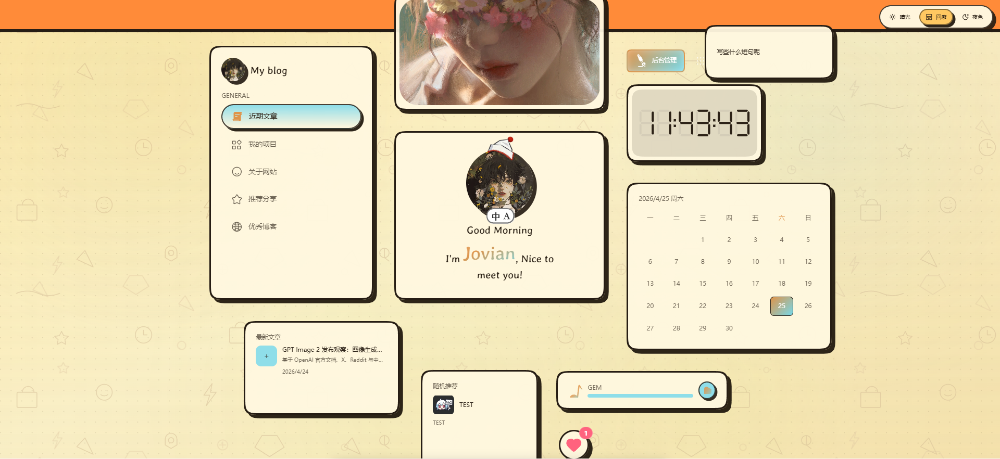
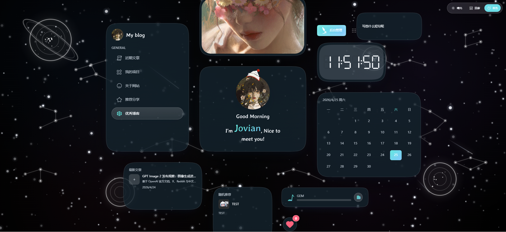
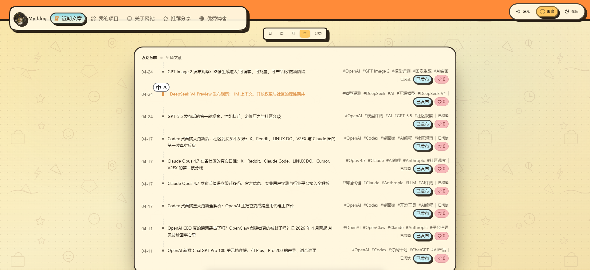
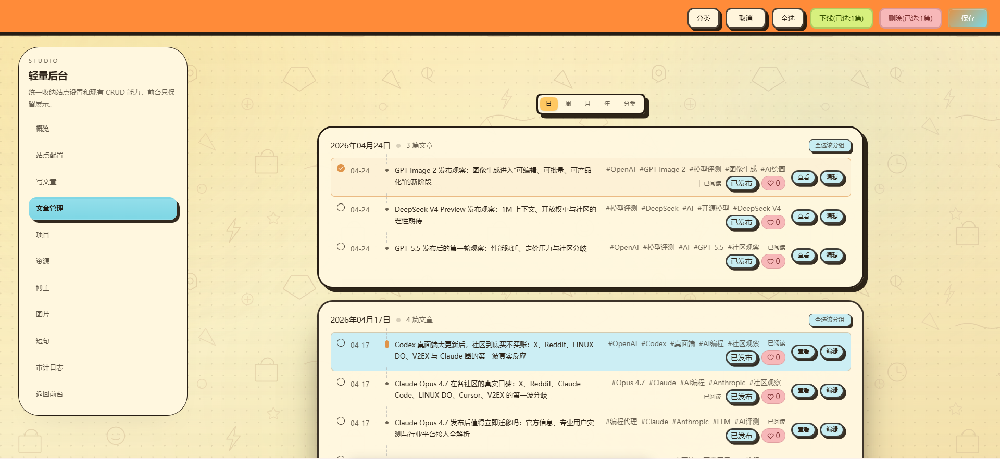

# Jovian Blog

<p align="center">
  <strong>基于 Next.js 16、React 19、OpenNext 与 Cloudflare 的现代化个人博客 / 内容管理系统模板。</strong>
</p>

<p align="center">
  <a href="./LICENSE"></a>
  
  
  
  
</p>

## 项目简介

Jovian Blog 是一个面向个人站点、技术博客、作品集与轻量 CMS 场景的开源模板。项目将前台展示、后台管理、结构化内容 API、本地内容回退、Cloudflare 部署链路以及本地 MCP 内容工具整合在同一个仓库中，适合二次开发、私有化部署或作为个人博客系统的起点。

项目默认提供公开模板数据，并将本地开发产生的内容、媒体与运行时文件写入 `.local-content/`，避免把私有内容误提交到仓库。

## 核心特性

- **前台门户**：首页卡片、博客、项目、资源、博主、图片、短句、关于页等展示模块。
- **后台工作区**：内置 `/studio` 管理入口，支持站点配置、文章、结构化内容与审计日志管理。
- **Markdown 写作**：支持 Markdown 渲染、代码高亮、KaTeX、目录与图片处理。
- **内容存储分层**：开发环境可使用本地文件回退，生产环境预留 Cloudflare D1 与 R2 绑定。
- **AI / MCP 工作流**：内置 `blog-publisher` 与 `content-admin` 本地 MCP server，便于把对话整理为博客或结构化内容。
- **Cloudflare 原生部署**：通过 `@opennextjs/cloudflare` 构建并部署到 Cloudflare Workers。
- **主题与动效**：包含 Tailwind CSS、Motion、SVG 图标、节日帽子、背景特效与音乐清单生成。

## 示例截图

| 首页 | 夜色主题主页 | 博客列表 | 后台工作区 |
| --- | --- | --- | --- |
|  |  |  |  |

```bash
pnpm dev
# 打开 http://127.0.0.1:2025、/blog、/studio 后截图保存至 public/screenshots/
# 夜色主题主页图可保存为 public/screenshots/home-night.svg 或 home-night.png
```

## 技术栈

| 分类 | 技术 |
| --- | --- |
| 应用框架 | Next.js 16 App Router |
| UI 运行时 | React 19、React DOM 19 |
| 开发语言 | TypeScript |
| 样式系统 | Tailwind CSS 4、PostCSS、tailwind-merge、tailwindcss-animate |
| 动效与图标 | Motion、Lucide React、SVGR |
| 内容渲染 | Marked、Shiki、KaTeX、html-react-parser |
| 状态与数据 | Zustand、SWR、Day.js |
| 部署平台 | OpenNext Cloudflare、Cloudflare Workers、Wrangler |
| 数据与媒体 | Cloudflare D1、Cloudflare R2、本地 `.local-content/` 回退 |
| 工程化 | pnpm、Prettier、Next typegen、TypeScript typecheck |
| AI 工具链 | 本地 stdio MCP server、Codex / Claude Skills 目录 |

## 目录结构

```text
.
├── migrations/                  # Cloudflare D1 数据库迁移
├── public/                      # 静态资源、图片、音乐、favicon、截图
├── scripts/                     # 构建辅助、MCP server、内容检查脚本
├── seeds/content/               # 模板结构化内容种子数据
├── skills/                      # 项目配套 Codex / Claude 内容工作流 skills
├── src/
│   ├── app/                     # Next.js App Router 页面与 API
│   │   ├── (home)/              # 首页
│   │   ├── api/                 # 内容、管理、上传、点赞等接口
│   │   ├── blog/                # 博客列表与详情
│   │   ├── studio/              # 后台管理工作区
│   │   ├── projects/            # 项目展示
│   │   ├── share/               # 资源分享
│   │   ├── bloggers/            # 博主列表
│   │   ├── pictures/            # 图片墙
│   │   └── snippets/            # 短句模块
│   ├── components/              # 通用组件
│   ├── config/                  # 默认内容与多语言配置
│   ├── hooks/                   # React hooks
│   ├── layout/                  # 页面布局、页头、页脚、背景
│   ├── lib/                     # 工具函数、服务端内容层、渲染器
│   ├── styles/                  # 全局样式与文章样式
│   └── svgs/                    # SVG 图标源文件与索引
├── wrangler.toml                # Cloudflare Workers / D1 / R2 配置
├── open-next.config.ts          # OpenNext Cloudflare 配置
├── next.config.ts               # Next.js 配置
└── package.json                 # 脚本与依赖
```

## 快速开始

### 环境要求

- Node.js 20 或更高版本，推荐使用当前 LTS。
- pnpm 8.15.4 或更高版本。
- 如需部署 Cloudflare：准备 Cloudflare 账号，并安装 / 登录 Wrangler。

### 1. 克隆项目

```bash
git clone https://github.com/your-name/2025-blog-public.git
cd 2025-blog-public
```

### 2. 安装依赖

```bash
pnpm install
```

### 3. 配置环境变量

```bash
cp .env.example .env.local
```

根据你的站点信息修改 `.env.local`：

```env
SITE_URL=http://127.0.0.1:2025
NEXT_PUBLIC_SITE_URL=http://127.0.0.1:2025
ADMIN_ALLOWLIST=owner@example.com
BLOG_ADMIN_TOKEN=replace-with-a-long-random-token
BLOG_LOCAL_ADMIN_BYPASS=true
AI_PROVIDER=mock
BLOG_BASE_URL=http://127.0.0.1:2025
```

常用变量说明：

| 变量 | 说明 |
| --- | --- |
| `SITE_URL` | 服务端使用的站点地址。 |
| `NEXT_PUBLIC_SITE_URL` | 浏览器端可见的站点地址。 |
| `ADMIN_ALLOWLIST` | 后台管理员邮箱白名单。 |
| `BLOG_ADMIN_TOKEN` | `/api/admin/*` 管理接口令牌，生产环境必须设置为强随机值。 |
| `BLOG_LOCAL_ADMIN_BYPASS` | 本地开发是否绕过后台鉴权，生产环境不要开启。 |
| `AI_PROVIDER` | AI 提供方，模板默认可使用 `mock`。 |
| `OPENAI_API_KEY` | 使用 OpenAI 生成能力时配置。 |
| `BLOG_BASE_URL` | 本地 MCP server 访问博客 API 的基础地址。 |

### 4. 启动开发服务

```bash
pnpm dev
```

默认访问地址：

```text
http://127.0.0.1:2025
```

常用页面：

| 页面 | 地址 |
| --- | --- |
| 首页 | `http://127.0.0.1:2025/` |
| 博客 | `http://127.0.0.1:2025/blog` |
| 项目 | `http://127.0.0.1:2025/projects` |
| 资源 | `http://127.0.0.1:2025/share` |
| 后台 | `http://127.0.0.1:2025/studio` |
| 写作 | `http://127.0.0.1:2025/write` |

### 5. 初始化本地 D1（可选）

项目在本地开发时可以回退到 `.local-content/` 文件存储；如果你希望联调 Cloudflare D1 路径，可执行：

```bash
pnpm db:migrate:local
```

## 开发命令

| 命令 | 说明 |
| --- | --- |
| `pnpm dev` | 启动 Next.js 开发服务，默认端口 `2025`。 |
| `pnpm build` | 执行标准 Next.js 生产构建。 |
| `pnpm start` | 启动 Next.js 生产服务。 |
| `pnpm typegen` | 生成 Next.js 类型。 |
| `pnpm typecheck` | 执行类型检查。 |
| `pnpm check:mcp` | 校验本地 MCP server 工具定义。 |
| `pnpm check:skills` | 校验本地 skills 元数据。 |
| `pnpm check` | 顺序执行类型检查与 AI 工具链检查。 |
| `pnpm music:manifest` | 生成 `src/generated/music-manifest.json`。 |
| `pnpm svg` | 生成 SVG 图标索引。 |
| `pnpm build:cf` | 使用 OpenNext 构建 Cloudflare 产物。 |
| `pnpm preview` | 本地预览 Cloudflare Workers 产物。 |
| `pnpm deploy` | 部署到 Cloudflare Workers。 |
| `pnpm db:migrate:local` | 应用本地 D1 migrations。 |
| `pnpm db:migrate:remote` | 应用远程 D1 migrations。 |

## 内容管理

### 前台内容模块

模板内置以下结构化内容模块：

- `site-content`：站点标题、描述、社交按钮、主题、背景与偏好设置。
- `about`：关于页内容。
- `projects`：项目 / 作品集列表。
- `shares`：资源分享列表。
- `bloggers`：友链或博主列表。
- `pictures`：图片组。
- `snippets`：短句。
- `card-styles`：首页卡片样式。

公开种子数据位于 `seeds/content/`，本地运行时内容默认写入 `.local-content/`。

### 后台管理

后台入口为 `/studio`，包含：

- 站点设置：维护标题、描述、主题、头像、背景、社交按钮等。
- 写作与文章管理：创建、编辑、预览、发布草稿。
- 结构化模块管理：项目、资源、博主、图片、短句、关于页。
- 审计日志：记录后台写入行为，便于排查内容变更。

### API 约定

- `/api/content/*`：公开内容读取接口。
- `/api/admin/*`：后台写入接口，需要令牌、Cloudflare Access 或管理员校验。
- `/api/uploads/*`：媒体上传与本地 / R2 回退链路。
- `/api/likes/*`：点赞计数相关接口。

## MCP 与 AI 工作流

项目附带两个本地 stdio MCP server：

| Server | 入口 | 作用 |
| --- | --- | --- |
| `blog-publisher` | `scripts/blog-mcp-server.mjs` | 创建博客草稿、发布文章、查询文章。 |
| `content-admin` | `scripts/content-mcp-server.mjs` | 管理站点配置、项目、资源、博主、图片、短句、关于页。 |

### Codex MCP 示例

```bash
codex mcp add blog-publisher \
  --env BLOG_BASE_URL=http://127.0.0.1:2025 \
  --env BLOG_ADMIN_TOKEN=replace-with-a-long-random-token \
  -- node D:\IDEA\Project\2025-blog-public\scripts\blog-mcp-server.mjs
```

```bash
codex mcp add content-admin \
  --env BLOG_BASE_URL=http://127.0.0.1:2025 \
  --env BLOG_ADMIN_TOKEN=replace-with-a-long-random-token \
  -- node D:\IDEA\Project\2025-blog-public\scripts\content-mcp-server.mjs
```

仓库还提供了内容工作流 skills：

- `skills/discussion-to-blog/`
- `skills/discussion-to-projects/`
- `skills/discussion-to-shares/`
- `skills/discussion-to-bloggers/`
- `skills/discussion-to-pictures/`
- `skills/discussion-to-snippets/`
- `skills/discussion-to-site-config/`
- `skills/discussion-to-about/`

## 部署指南

### 方案一：Cloudflare Workers + D1 + R2（推荐）

项目已配置 `@opennextjs/cloudflare`，适合部署到 Cloudflare Workers。

#### 1. 登录 Cloudflare

```bash
pnpm dlx wrangler login
```

#### 2. 创建 D1 数据库

```bash
pnpm dlx wrangler d1 create blog-content
```

将返回的 `database_id` 写入 `wrangler.toml`：

```toml
[[d1_databases]]
binding = "BLOG_DB"
database_name = "blog-content"
database_id = "your-d1-database-id"
migrations_dir = "migrations"
```

#### 3. 创建 R2 Bucket

```bash
pnpm dlx wrangler r2 bucket create blog-media-prod
```

确认 `wrangler.toml` 中的绑定：

```toml
[[r2_buckets]]
binding = "BLOG_MEDIA"
bucket_name = "blog-media-prod"
```

#### 4. 配置生产环境变量

```bash
pnpm dlx wrangler secret put BLOG_ADMIN_TOKEN
pnpm dlx wrangler secret put OPENAI_API_KEY
```

如需 Cloudflare Access 保护管理接口，可额外配置：

```bash
pnpm dlx wrangler secret put CF_ACCESS_CLIENT_ID
pnpm dlx wrangler secret put CF_ACCESS_CLIENT_SECRET
```

#### 5. 应用远程 D1 迁移

```bash
pnpm db:migrate:remote
```

#### 6. 构建并部署

```bash
pnpm build:cf
pnpm deploy
```

也可以使用：

```bash
pnpm preview
```

在本地预览 Cloudflare Workers 产物。

### 方案二：传统 Node.js 部署

适合 VPS、Docker 或支持 Node.js 的平台。注意：该方案不包含 Cloudflare D1 / R2 绑定能力，建议用于开发、演示或你自行改造存储层后使用。

```bash
pnpm install --frozen-lockfile
pnpm build
pnpm start
```

默认启动端口取决于 Next.js 配置与运行环境。开发端口固定由 `pnpm dev` 指定为 `2025`。

### 方案三：作为模板二次开发

1. Fork 或克隆本仓库。
2. 替换 `seeds/content/` 中的默认内容。
3. 替换 `public/favicon.png`、`public/images/avatar.png`、`public/images/art/` 等品牌资源。
4. 修改 `.env.local` 与 `wrangler.toml`。
5. 开启后台鉴权与 Cloudflare Access。
6. 部署到 Cloudflare，并通过 `/studio` 完成站点初始化。

## 开发规划

### 已完成 / 当前能力

- [x] Next.js 16 + React 19 应用骨架。
- [x] 首页、博客、项目、资源、博主、图片、短句、关于页。
- [x] `/studio` 后台工作区。
- [x] 结构化内容 API 与本地文件回退。
- [x] D1 migrations 与 Cloudflare 绑定配置。
- [x] R2 媒体绑定预留。
- [x] 本地 MCP server 与项目 skills。
- [x] 音乐清单与 SVG 图标生成脚本。

### 短期计划

- [ ] 补充 Playwright 或 Vitest 自动化测试。
- [ ] 完善截图与在线演示站点。
- [ ] 增加 Dockerfile 与 docker-compose 示例。
- [ ] 优化 `/studio` 权限模型与角色管理。
- [ ] 增加内容导入 / 导出工具。

### 中期计划

- [ ] 提供更完整的主题市场与卡片布局预设。
- [ ] 支持多语言内容管理。
- [ ] 支持文章版本历史与回滚。
- [ ] 增加 RSS / Sitemap 的配置化能力。
- [ ] 完善媒体库管理与 R2 CDN 配置文档。

### 长期计划

- [ ] 插件化内容模块。
- [ ] 多站点 / 多租户部署模式。
- [ ] 可视化页面搭建能力。
- [ ] AI 写作、摘要、标签与 SEO 自动化工作流。
- [ ] 更完整的观测、审计与备份恢复方案。

## 贡献指南

欢迎通过 Issue、Pull Request 或讨论改进项目。建议流程：

1. Fork 本仓库。
2. 创建特性分支：`git checkout -b feat/your-feature`。
3. 安装依赖并完成开发：`pnpm install && pnpm dev`。
4. 提交前执行检查：`pnpm check`。
5. 提交 PR，并说明变更动机、影响范围与截图。

提交信息建议使用 Conventional Commits：

```text
feat: add project card layout
fix: handle empty blog list
chore: update dependencies
```

## 安全建议

- 生产环境必须设置 `BLOG_ADMIN_TOKEN`，并使用足够长的随机值。
- 生产环境不要开启 `BLOG_LOCAL_ADMIN_BYPASS`。
- 不要提交 `.env.local`、`.mcp.json`、`.local-content/`、日志文件或私有媒体。
- 推荐使用 Cloudflare Access 保护 `/studio` 与 `/api/admin/*`。
- 如果使用 MCP 访问生产环境，建议同时配置 Cloudflare Access Service Token 与应用层 `BLOG_ADMIN_TOKEN`。
- 定期备份 D1 数据与 R2 媒体资源。

## 常见问题

### 本地内容保存在哪里？

默认会写入 `.local-content/`。该目录已被 `.gitignore` 排除，适合保存本地开发内容与媒体回退文件。

### 是否必须使用 Cloudflare？

不是。开发与普通 Next.js 构建可以直接运行；但 D1、R2、Workers 部署链路依赖 Cloudflare，推荐生产环境使用 Cloudflare 方案。

### `pnpm dev` 的端口是什么？

项目脚本固定使用 `next dev --turbopack -p 2025`，默认地址是 `http://127.0.0.1:2025`。

### 如何修改站点默认内容？

修改 `seeds/content/` 中的 JSON 模板，或启动项目后通过 `/studio` 管理界面写入内容。

### 为什么 README 中的截图可能不显示？

如果 `public/screenshots/` 中没有对应图片，Markdown 会显示破图。运行项目后手动截图并保存为 `home.png`、`home-night.svg`、`blog.png`、`studio.png` 即可。

## 致谢

感谢以下开源项目与服务为本项目提供基础能力与灵感：

- [Next.js](https://nextjs.org/) 与 [React](https://react.dev/)：提供现代化 Web 应用框架与 UI 运行时。
- [OpenNext Cloudflare](https://opennext.js.org/cloudflare) 与 [Cloudflare Workers](https://workers.cloudflare.com/)：提供边缘部署、D1 数据库与 R2 对象存储能力。
- [Tailwind CSS](https://tailwindcss.com/)、[Motion](https://motion.dev/)、[Lucide](https://lucide.dev/)：帮助构建响应式界面、动效与图标系统。
- [Marked](https://marked.js.org/)、[Shiki](https://shiki.style/) 与 [KaTeX](https://katex.org/)：支持 Markdown、代码高亮与数学公式渲染。
- https://github.com/YYsuni/2025-blog-public：提供的布局与思路
- 感谢所有使用、反馈、提交 Issue 与 Pull Request 的朋友，让这个模板持续变得更好。
## 许可证

本项目基于 [GNU General Public License v3.0](./LICENSE) 开源。

你可以自由使用、复制、修改和分发本项目，但如果分发修改版或衍生作品，需要遵守 GPL-3.0 的源代码开放与相同许可证条款要求。

